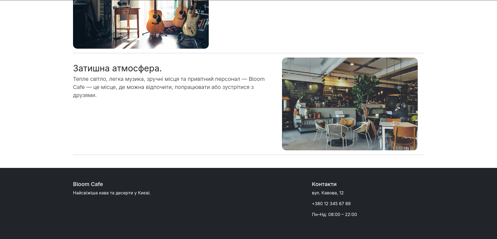
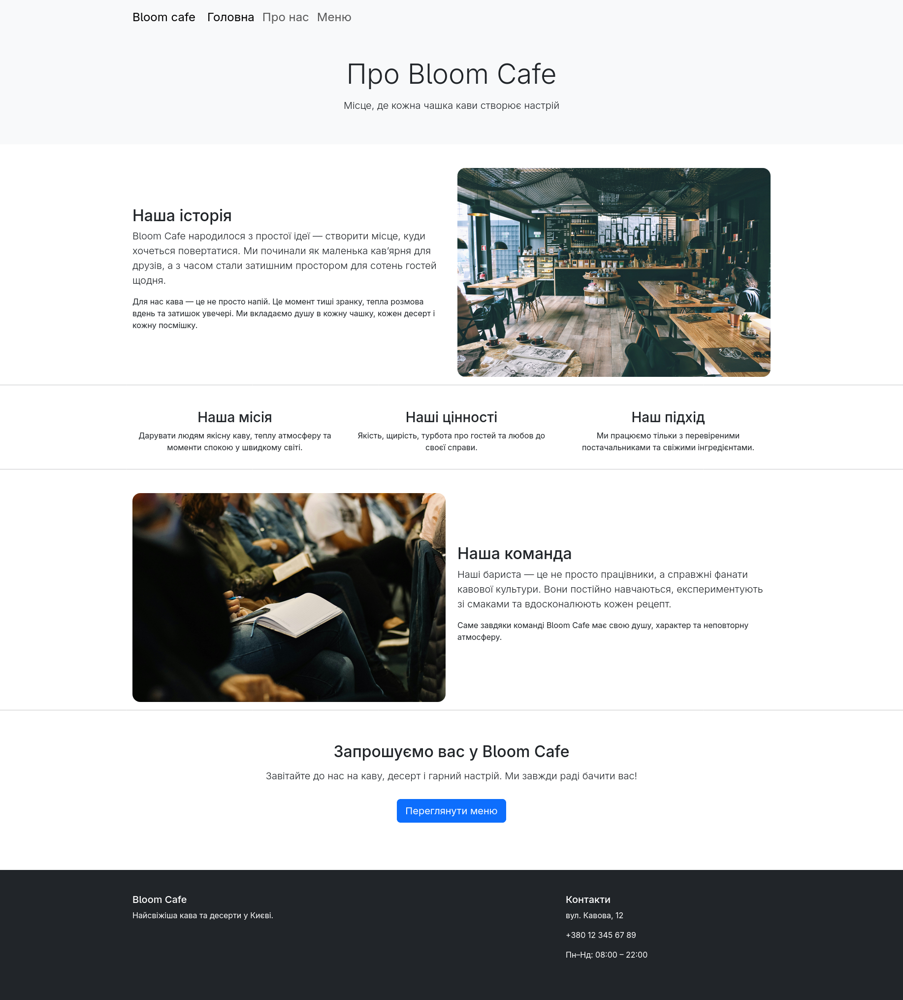
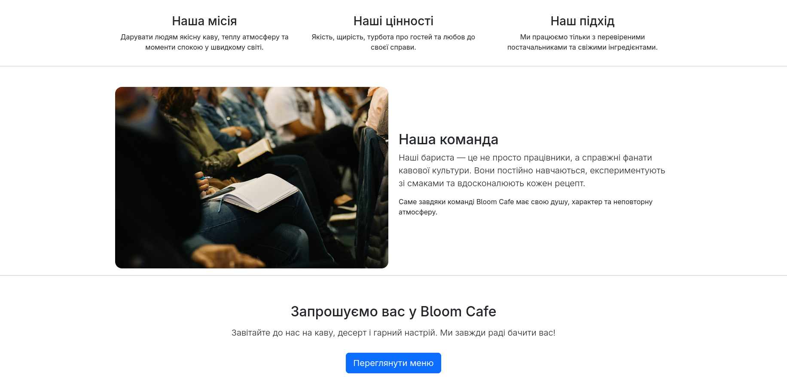
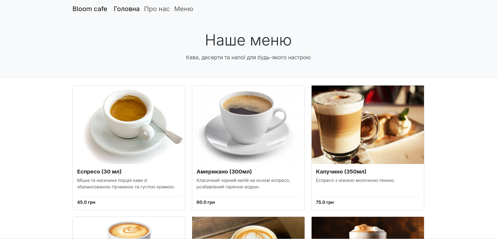
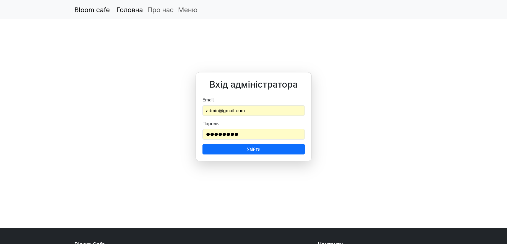
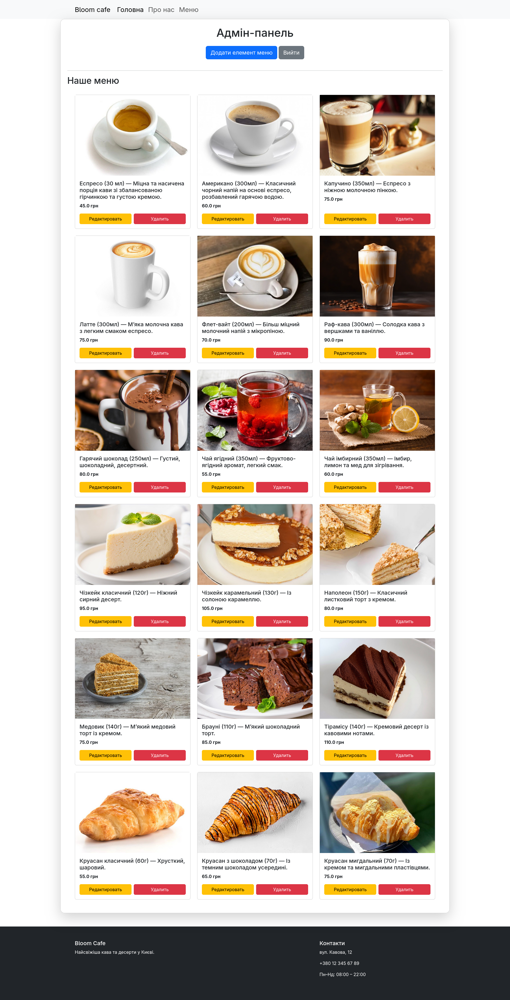
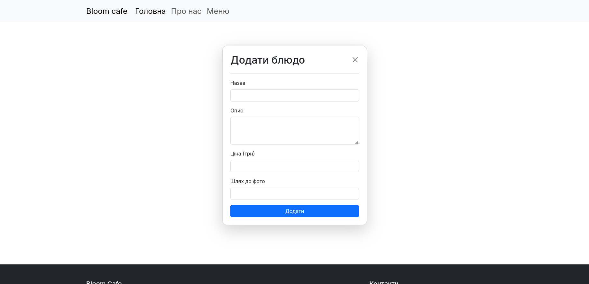

# Cafe Website

A simple coffee shop website built with **Flask**.  
Includes a public website and an admin panel for managing menu items.

## Screenshots

### Home page



### About us



### Menu


### Admin panel




## Features

- Public pages (home, menu, about)
- UI built with Bootstrap
- Admin panel
- CRUD operations for menu items
- Password hashing with Flask-Bcrypt
- Database with Flask-SQLAlchemy
- Environment variables support with python-dotenv
- Modular structure using Blueprints

## Tech Stack
- Python
- Flask (Blueprints)
- Flask-SQLAlchemy
- Flask-Bcrypt
- Jinja2
- Bootstrap 5
- SQLite

## Installation & Run

```bash
git clone https://github.com/nikita-dev17/cafe-website.git
cd cafe-website

python -m venv venv
source venv/bin/activate

pip install -r requirements.txt

cp .env.example .env
# edit .env if needed

python -m cafe_website.app
